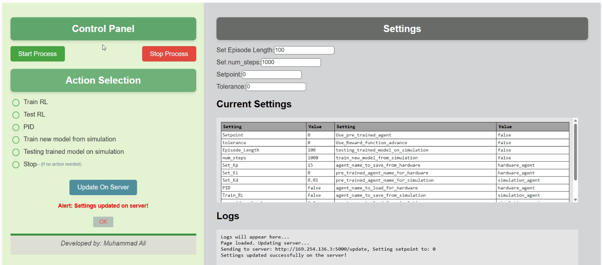
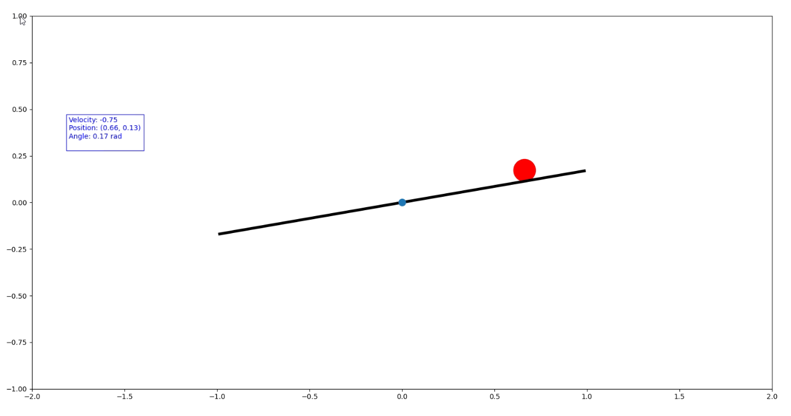

RL Agent to Control Ball Position on Seesaw
This repository contains the implementation of a Reinforcement Learning (RL) agent and a PID controller for a dynamic seesaw control system. The RL agent is trained in a simulation environment to balance the ball at a specific setpoint on the seesaw and is later deployed on physical hardware for real-world testing and validation.

Key Features
1. Reinforcement Learning (RL) Agent
Trains in a simulation environment to achieve precise control of the ball's position on the seesaw.
Learns optimal control strategies through trial and error using reward-based feedback.
Capable of adapting to dynamic environments and maintaining stability under various conditions.
2. PID Controller
Implements a classical control method to manage the seesaw in real-time.
Provides a reliable baseline for comparison with the performance of the RL agent.
Works seamlessly in tandem with the RL agent for hybrid control approaches.
3. Flask Server Integration
Offers an intuitive dashboard interface for system management:
Monitor real-time data such as the current ball position, beam angle, and control performance metrics.
Send manual or automated control commands to the hardware.
Easily switch between PID and RL-based control strategies.
Enables smooth communication between the control algorithm and the physical hardware.

System Overview
Training Phase:

The RL agent is trained in a simulated environment, allowing for safe and efficient learning without risking damage to hardware.
The training process leverages advanced RL algorithms to minimize errors and stabilize the ball quickly.
Deployment Phase:

Once trained, the RL agent is deployed to control the actual seesaw hardware.
The Flask server facilitates communication, enabling the hardware to execute the agent’s actions in real time.
Comparison & Analysis:

Performance metrics from both the RL agent and the PID controller are analyzed to evaluate their effectiveness.
Visualizations and logs provide insights into system behavior under different control strategies.
Repository Structure
Simulation Files: Includes all code and configurations required for training the RL agent in a simulated environment.
Hardware Control: Scripts to deploy and control the physical seesaw system using trained RL models or PID controllers.
Flask Dashboard: Codebase for the user-friendly web interface to monitor and interact with the system.
Documentation: Detailed guidelines for setting up, training, and deploying the system.
Related Repository
This project complements the Flask server setup available here:
👉 Flask for Seesaw Control System: https://github.com/MuhammadAliacc/Flask-For-Seesaw-Control-System
The Flask repository contains the tools and instructions needed to establish the communication infrastructure between the hardware and control algorithms.

Contribute
Explore this project to see how Reinforcement Learning and PID control techniques can achieve efficient control in dynamic systems. Contributions are welcome to improve the codebase, add new features, or enhance the system's performance.

For feedback or questions, feel free to open an issue or contact me directly.
